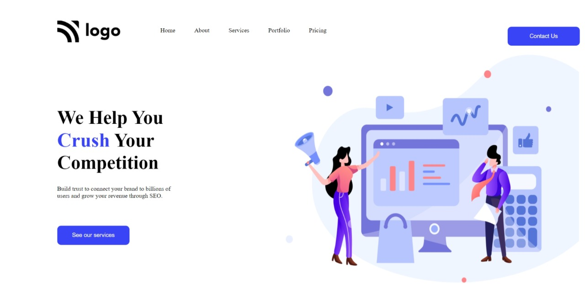

# Project-04-  A Small Web page Template
 ## Hey there ,  I am Shashi Raj 
 I have build a template of HTML and CSS project using my core CSS skill. 
 
 
 
 
 

 My Live Deployed Website Link :- [Click here !](https://project4-shashi.netlify.app/)

 
 

 ### It took almost 3 hour to comlete.

 ### What I learned from this project 
 - First of all I explore more about image adjustment on web page.
 - Then I learbed a little bit about hover effects .
